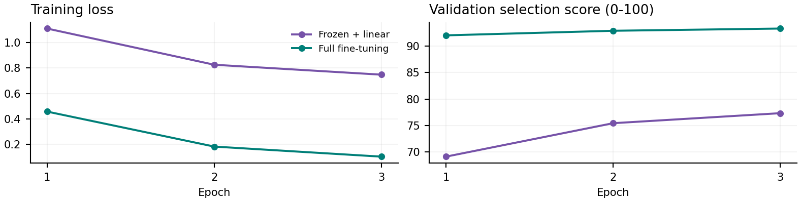
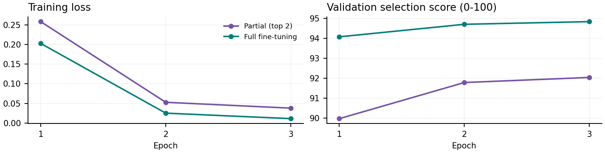
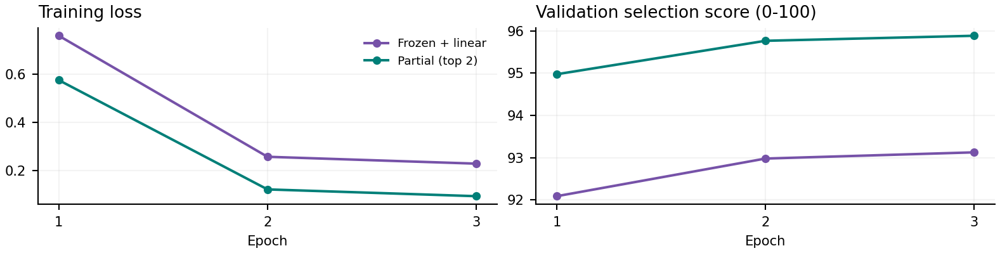
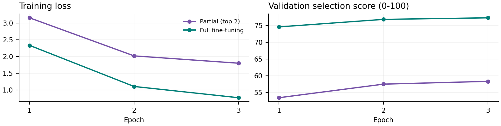

# Adapting BERT for NLP Tasks

**Four tasks. Eight trained alternatives. Three adaptation strategies.** This study measures what freezing, partially adapting, and fully adapting BERT change in predictive quality and training cost. Each delivered model was selected on validation data before its held-out evaluation.

## Main results

| Task | Method | Deliver | Test score /100 | Trainable M | Train sec. |
| --- | --- | --- | --- | --- | --- |
| AG News | Frozen + linear | No | Macro-F1: 76.83 | 0.003 | 91.8 |
| AG News | Full fine-tuning | Yes | Macro-F1: 92.51 | 109.485 | 309.0 |
| NER | Partial (top 2) | No | Entity F1: 89.11 | 14.183 | 145.8 |
| NER | Full fine-tuning | Yes | Entity F1: 91.50 | 107.727 | 441.9 |
| POS | Frozen + linear | No | Accuracy: 93.23 | 0.013 | 79.9 |
| POS | Partial (top 2) | Yes | Accuracy: 95.73 | 14.189 | 110.3 |
| QA | Partial (top 2) | No | Answer F1: 61.75 | 14.177 | 305.7 |
| QA | Full fine-tuning | Yes | Answer F1: 83.28 | 108.893 | 846.0 |

Metrics use a 0-100 display scale, but they measure different outcomes. Scores should be compared within a task, not used to rank task difficulty. Training time excludes validation, downloads, checkpoint saving and final evaluation.

## What the measurements support

Full fine-tuning was selected for AG News, NER and QA; partial fine-tuning was selected for POS. Relative to their trained alternatives, the selected models gained 15.68 macro-F1 points on AG News, 2.39 strict entity-F1 points on NER, 2.50 accuracy points on POS, and 21.53 answer-F1 points on QA.

**Interpretation:** the large AG News and QA gaps support adapting BERT for these specific settings. NER and POS gaps are within the assignment's approximate 1-3 point seed-variation caution. With one seed per configuration, these are operational choices under the stated selection rule, not statistically established rankings.

## Scope of the evidence

All eight alternatives ran for three epochs with seed 42 on one NVIDIA GeForce RTX 4060 Ti. Saved configurations, histories, predictions, source snapshots and exported checkpoints support the reported measurements. No additional seeds or test-driven hyperparameter searches were performed. The previous draft numbers are superseded by this report.

# Study design and adaptation choices

BERT produces contextual representations by conditioning each token on surrounding tokens. The pretrained encoder is reused while the task head changes [1]. The experiment asks how much of this shared encoder should be updated, rather than training a language model from scratch.

| Strategy | Trainable components | Implementation |
| --- | --- | --- |
| Frozen features | Task head only | BERT remains in evaluation mode; no encoder gradients. AG News and POS use linear heads. |
| Partial adaptation | Head + final 2 of 12 encoder layers | Embeddings and lower 10 layers are frozen; dropout in the frozen portion is disabled. |
| Full adaptation | Embeddings, all encoder layers and head | All parameters update through the task loss. |

Frozen features are recomputed during training; there is no offline embedding cache. Frozen-parameter hashes were checked for invariance. This keeps the measured comparison tied to the implemented workflow rather than an idealized minimum feature-extraction cost.

## Data and heads

| Task / base checkpoint | Train / val. / test | Output head |
| --- | --- | --- |
| AG News / uncased | 12,000 / 2,000 / 2,000 texts | Pooled BERT output -> 4 class logits |
| NER / cased | 14,041 / 3,250 / 3,453 sentences | Per-token linear head -> 9 BIO labels |
| POS / uncased | 12,544 / 2,001 / 2,077 sentences | Per-token linear head -> 17 UPOS labels |
| QA / uncased | 15,000 / 2,000 / 2,000 questions | Per-token start and end scores |

AG News uses stratified subsets and removes normalized exact text duplicates before sampling (161 official-train rows excluded). NER and POS retain their official splits. Exact sentence overlaps were audited: NER train/val 129, train/test 78, val/test 25; POS 36, 47 and 27 respectively. Retaining these benchmark repetitions limits claims of wholly independent linguistic content. [2-4]

QA reserves 15% of official training article titles for internal validation before sampling. The official validation split supplies the held-out test subset. No contexts overlap between the three selected subsets. These are custom evaluation subsets, not a claim of full official leaderboard performance. [5]

## Optimization held constant within comparisons

AdamW uses head learning rate 1e-3 and trainable encoder learning rate 2e-5, weight decay 0.01, 10% linear warmup, and gradient-norm clipping at 1.0. Separate parameter groups let a new head adapt faster while limiting updates to pretrained weights. The effective batch size is 32 for AG News and 16 for NER, POS and QA. CUDA bf16 was used. Exact package versions and model/dataset revisions are archived.

# Evaluation, alignment and selection

| Task | Selection metric | Why this metric |
| --- | --- | --- |
| AG News | Validation macro-F1 | Gives each of the four topics equal weight; accuracy is also reported. |
| NER | Strict IOB2 micro entity F1 | Requires the correct entity type and complete word boundaries; O-token accuracy can hide errors. |
| POS | Word accuracy | Matches the per-word tagging objective; macro-F1 exposes weaker or less frequent tags. |
| QA | Normalized answer token F1 | Measures partial answer overlap; exact match requires complete normalized agreement. |

The best validation epoch is retained, with the earliest epoch winning exact ties. Between methods, a tied selection score favors fewer trainable parameters. All selected checkpoints happened to be epoch 3. The method choice is persisted before test evaluation. Both selected and rejected alternatives are reported.

## First-subtoken supervision for NER and POS

Each word label is assigned only to its first WordPiece token. Continuation pieces, special tokens and padding receive -100 and do not contribute to cross-entropy. Loss is weighted by supervised words across accumulated batches. Dynamic padding is used; no NER/POS examples were truncated.

| Task | Observed token | Original word | Training label |
| --- | --- | --- | --- |
| NER | [CLS] | - | -100 (ignored) |
| NER | la | lamb | O |
| NER | ##mb | lamb | -100 (ignored) |
| POS | za | Zaman | PROPN |
| POS | ##man | Zaman | -100 (ignored) |

These rows come from the saved alignment_check.csv files, not a hypothetical tokenizer example. Maximum observed subtoken lengths were 173 for NER and 337 for POS, below BERT's positional capacity.

## QA uses span targets, not BIO labels

Question and context are tokenized together with segment IDs. Overlapping 384-token windows use stride 128. Gold character offsets are mapped to start/end token positions; a window without the complete answer uses CLS for both targets. This is the task-specific equivalent of checking label alignment: a QA head does not use the NER/POS -100 word-label scheme.

Decoding masks non-context tokens, considers the top 20 start and end candidates, rejects reversed or over-30-token spans, and chooses the highest summed score across windows. EM and F1 use SQuAD normalization and the maximum over annotated references [6]. Per-window loss and per-question evaluation must not be confused.

# AG News: adapting document representations

Working expectation: a frozen encoder should provide a useful baseline, while full adaptation may better separate nearby topics. Both alternatives use the same pooled-output linear classifier, so this comparison changes encoder adaptation rather than classifier capacity.

| Method | Test accuracy | Test macro-F1 | Training sec. |
| --- | --- | --- | --- |
| Frozen + linear | 76.90 | 76.83 | 91.8 |
| Full fine-tuning | 92.50 | 92.51 | 309.0 |



| Method | Epoch | Train loss | Val. score | Train sec. |
| --- | --- | --- | --- | --- |
| Frozen + linear | 1 | 1.1102 | 69.11 | 31.1 |
| Frozen + linear | 2 | 0.8260 | 75.44 | 31.4 |
| Frozen + linear | 3 | 0.7481 | 77.33 | 29.3 |
| Full fine-tuning | 1 | 0.4582 | 92.06 | 101.3 |
| Full fine-tuning | 2 | 0.1835 | 92.92 | 103.9 |
| Full fine-tuning | 3 | 0.1046 | 93.34 | 103.9 |

## Decision and error analysis

Full fine-tuning was selected. It classified 1,850 of 2,000 test texts correctly versus 1,538 for the frozen alternative: a 15.60-point accuracy gain at 3.37 times the training time. The result supports the working expectation for this head, subset and configuration; it does not rule out stronger frozen-feature classifiers.

Among the winner's 150 mistakes, 77 crossed the Business/Sci-Tech boundary (51 Business -> Sci/Tech and 26 in the reverse direction). Sports had 488/500 correct labels; Business had 435/500. Mixed business/technology content illustrates a difficult boundary without proving annotation error or a causal explanation.

Inputs are capped at 128 tokens. Validation loss rose from epoch 2 to 3 while macro-F1 improved; checkpoint selection remained based on the predefined macro-F1 criterion. Loss also reflects confidence, so the metrics need not move together. The experiment does not evaluate Spanish or other news distributions.

# NER: entity boundaries and types

Working expectation: adapting the final two layers may recover much of the entity-labeling benefit; full adaptation could add a smaller gain at higher cost. BERT-base-cased preserves case information that can be useful for entity names. This experiment did not isolate the effect of casing.

| Method | Precision | Recall | Strict entity F1 | Train sec. |
| --- | --- | --- | --- | --- |
| Partial (top 2) | 89.10 | 89.13 | 89.11 | 145.8 |
| Full fine-tuning | 91.13 | 91.87 | 91.50 | 441.9 |



| Method | Epoch | Train loss | Val. score | Train sec. |
| --- | --- | --- | --- | --- |
| Partial (top 2) | 1 | 0.2582 | 89.98 | 49.2 |
| Partial (top 2) | 2 | 0.0527 | 91.79 | 48.3 |
| Partial (top 2) | 3 | 0.0378 | 92.04 | 48.3 |
| Full fine-tuning | 1 | 0.2027 | 94.08 | 145.9 |
| Full fine-tuning | 2 | 0.0251 | 94.70 | 148.2 |
| Full fine-tuning | 3 | 0.0110 | 94.84 | 147.8 |

## Decision and error analysis

Full fine-tuning was selected by validation. It recovered 5,189 of 5,648 gold entities, versus 5,034 for partial adaptation, and produced 505 false-positive entities. Its 2.39-point test F1 advantage cost 3.03 times the training time. This gap is within the assignment's 1-3 point seed-variation warning; one run cannot establish that full adaptation is reliably better.

Gold-entity errors for the selected model included 220 wrong types at exact boundaries, 157 overlapping boundary errors, and 82 missed entities. These three gold-error categories are disjoint; false-positive predictions are counted separately. MISC F1 was 81.46, compared with 96.14 for PER, indicating uneven performance across types.

The primary scorer is seqeval strict IOB2. Secondary conlleval-style F1 is 87.96 for partial and 91.04 for full adaptation. Invalid BIO sequences are interpreted differently by these conventions, so strict scores are not directly interchangeable with other reported CoNLL scores. Predictions were not repaired. [7]

# POS: useful gains from limited adaptation

Working expectation: pretrained representations already encode useful grammar, but allowing two final layers to adapt may improve token decisions. Both methods use the same 17-class linear head. UD English EWT r2.15 CoNLL-U files are used directly for compatibility and provenance [4].

| Method | Word accuracy | Macro-F1 (17 tags) | Training sec. |
| --- | --- | --- | --- |
| Frozen + linear | 93.23 | 86.51 | 79.9 |
| Partial (top 2) | 95.73 | 89.75 | 110.3 |



| Method | Epoch | Train loss | Val. score | Train sec. |
| --- | --- | --- | --- | --- |
| Frozen + linear | 1 | 0.7586 | 92.09 | 27.1 |
| Frozen + linear | 2 | 0.2569 | 92.98 | 25.7 |
| Frozen + linear | 3 | 0.2285 | 93.12 | 27.1 |
| Partial (top 2) | 1 | 0.5745 | 94.97 | 36.4 |
| Partial (top 2) | 2 | 0.1217 | 95.77 | 37.0 |
| Partial (top 2) | 3 | 0.0936 | 95.88 | 36.9 |

## Decision and error analysis

Partial adaptation was selected. It labeled 24,023 of 25,094 test words correctly, compared with 23,395 for the frozen encoder: 628 fewer mistakes and a 2.50-point accuracy gain. Training took 110.3 rather than 79.9 seconds (1.38 times as long). Macro-F1 improved by 3.24 points, from 86.51 to 89.75.

The selected model's main confusion counts included PROPN -> NOUN (180), NOUN -> PROPN (109), ADJ -> NOUN (64), and NOUN -> ADJ (60). Uncased input removes a potentially useful cue for proper nouns, but this run does not test whether a cased model would solve those errors.

Only integer-ID syntactic words are retained from CoNLL-U; multiword surface rows and empty nodes are skipped. Unknown or missing UPOS values raise an error. The 2.50-point accuracy gain is of the same order as the seed-variation caution; the selection is defensible under the fixed rule, but not a statistically robust superiority claim. Full fine-tuning was not tested for POS.

# QA: adapting BERT to extract answers

Working expectation: extracting a question-conditioned span may benefit more from updating the full encoder than from adapting two layers. Both methods start from the same uncased BERT checkpoint and a newly initialized span head, using the same questions and per-epoch batch order.

| Method | Test exact match | Test token F1 | Training sec. |
| --- | --- | --- | --- |
| Partial (top 2) | 47.80 | 61.75 | 305.7 |
| Full fine-tuning | 73.60 | 83.28 | 846.0 |



| Method | Epoch | Train loss | Val. score | Train sec. |
| --- | --- | --- | --- | --- |
| Partial (top 2) | 1 | 3.1610 | 53.50 | 94.2 |
| Partial (top 2) | 2 | 2.0229 | 57.54 | 105.7 |
| Partial (top 2) | 3 | 1.8039 | 58.37 | 105.8 |
| Full fine-tuning | 1 | 2.3374 | 74.58 | 284.0 |
| Full fine-tuning | 2 | 1.1082 | 76.82 | 283.4 |
| Full fine-tuning | 3 | 0.7722 | 77.28 | 278.5 |

## Decision and error analysis

Full fine-tuning was selected. It gained 21.53 test F1 points and 25.80 exact-match points, with 2.77 times the training time. Its 73.60 EM corresponds to 1,472 fully matching answers out of 2,000 questions. There were 186 questions with zero token overlap and 342 with partial overlap.

For a gold answer of "blazer", predicting "a compulsory blazer" has partial F1 but not exact match after normalization. Other errors select overly broad spans or a different passage fragment. These examples describe behavior; they are not evidence of a specific internal reasoning process.

All positive windows were audited for context-only, fully covering gold spans. Token boundaries expanded 41/10/3 annotated spans in train/validation/test. At least one supervised span of up to 30 tokens exists for 14,965/15,000 training, 1,994/2,000 validation and all 2,000 test questions. SQuAD 1.1 does not evaluate abstention; this model is not validated on unanswerable questions.

# Reproducibility and delivered artifacts

The local project contains four training scripts, four executed notebooks, per-run configurations, package locks, data manifests, validation histories, test predictions, selected checkpoints and tokenizers. Model cards describe data, methods, metrics, intended use, limitations and references. The notebooks identify whether they train or inspect saved evidence; POS and QA display the recorded runs rather than pretending to retrain them.

## Environment and rerun procedure

Recorded runtime: Python 3.12.14; PyTorch 2.6.0+cu124; Transformers 4.49.0; Datasets 3.3.2; Hugging Face Hub 0.29.3. Use the requirements-lock.txt inside the corresponding verified run, a matching CUDA-enabled PyTorch installation, and the task guide. Use a new output directory to preserve the original evidence.

```text
python src/verify_pos_qa_artifacts.py .
python src/pos_experiment.py --config runs/pos_verified/config.json --output runs/pos_replica
```

For QA, construct Config from runs/qa_verified/config.json and pass it to run with a new output directory, as shown in QA_GUIDE.md. This preserves source revisions; the default CLI resolves current upstream revisions. Fixed seeds do not guarantee bitwise reproduction on other hardware or kernels. QA SDPA backward emitted a nondeterminism warning.

## Evidence checks

Saved predictions were used to independently recalculate POS and QA metrics. Each exported weight file was hashed against its selected checkpoint; validation selection, best epochs, test identities and executed notebooks were checked. QA export reload reproduced all 2,000 test predictions. Its final comparison initially failed because Windows decoded a UTF-8 JSON file as cp1252. Only that read was corrected; no training was repeated. The original snapshot, failed status, exact patch and recovery hashes are retained.

## Hugging Face delivery status

**AG News:** [Terrificfantasm/bert-base-agnews-delivered](https://huggingface.co/Terrificfantasm/bert-base-agnews-delivered)<br>
Verified commit: c0ca4affe00337c719150f52419207efd75595ad

**Named entity recognition:** [Terrificfantasm/bert-base-cased-conll2003-ner](https://huggingface.co/Terrificfantasm/bert-base-cased-conll2003-ner)<br>
Verified commit: 2b344e3debaf208ecd68d2a5e6dcbbc292b07402

**Part-of-speech tagging:** [Terrificfantasm/bert-base-uncased-ud-ewt-pos](https://huggingface.co/Terrificfantasm/bert-base-uncased-ud-ewt-pos)<br>
Verified commit: db184e3b63980976c18c9df1da2fc5eb0792b959

**Extractive question answering:** [Terrificfantasm/bert-base-uncased-squad-qa](https://huggingface.co/Terrificfantasm/bert-base-uncased-squad-qa)<br>
Verified commit: 6a24d97e8418f229065762f247d25267dcbda79b

publication_manifest.json records repository URLs, revisions and verification. Repository access is checked separately from local export; an existing local model is not evidence of successful publication.

## Measured scope, not a production guarantee

The study uses one seed, a fixed three-epoch budget and a limited search space. Different optimization schedules, cached frozen features or alternative heads may change the trade-off. The benchmarks are English and do not establish performance on private business data, Spanish, deployment latency, fairness or calibration. Training time is not inference latency.

# References and provenance

[1] Devlin et al. (2019). BERT: Pre-training of Deep Bidirectional Transformers for Language Understanding.<br>
[https://arxiv.org/abs/1810.04805](https://arxiv.org/abs/1810.04805)

[2] AG News dataset distribution used in this experiment (fancyzhx/ag_news).<br>
[https://huggingface.co/datasets/fancyzhx/ag_news](https://huggingface.co/datasets/fancyzhx/ag_news)

[3] CoNLL-2003 dataset distribution used in this experiment (lhoestq/conll2003).<br>
[https://huggingface.co/datasets/lhoestq/conll2003](https://huggingface.co/datasets/lhoestq/conll2003)

[4] Universal Dependencies English EWT, release r2.15; CoNLL-U format.<br>
[https://github.com/UniversalDependencies/UD_English-EWT/tree/r2.15](https://github.com/UniversalDependencies/UD_English-EWT/tree/r2.15)

[5] Rajpurkar et al. SQuAD 1.1 dataset distribution.<br>
[https://huggingface.co/datasets/rajpurkar/squad](https://huggingface.co/datasets/rajpurkar/squad)

[6] SQuAD official v1.1 evaluation implementation.<br>
[https://github.com/rajpurkar/SQuAD-explorer/blob/master/evaluate-v1.1.py](https://github.com/rajpurkar/SQuAD-explorer/blob/master/evaluate-v1.1.py)

[7] seqeval sequence-labeling evaluation library (strict IOB2 configuration).<br>
[https://github.com/chakki-works/seqeval](https://github.com/chakki-works/seqeval)

[8] Hugging Face Transformers training documentation.<br>
[https://huggingface.co/docs/transformers/training](https://huggingface.co/docs/transformers/training)

[9] Google BERT-base uncased checkpoint.<br>
[https://huggingface.co/google-bert/bert-base-uncased](https://huggingface.co/google-bert/bert-base-uncased)

[10] Google BERT-base cased checkpoint.<br>
[https://huggingface.co/google-bert/bert-base-cased](https://huggingface.co/google-bert/bert-base-cased)

## Data and licensing notes

The base BERT checkpoint cards identify Apache-2.0 licensing. The AG News distribution lists its license as unknown, and the CoNLL distribution does not clearly supply a dataset license on its card. UD English EWT distributes a CC BY-SA 4.0 license; the SQuAD distribution also identifies CC BY-SA 4.0. Dataset terms are not replaced by the base-model license. Hub packages contain trained weights, tokenizers and documentation, not copies of the training corpora. Source links and source revisions remain in the model cards and run configurations.

## Final conclusion

The adaptation ladder is a measured trade-off, not a fixed ranking. Full adaptation yielded large gains for news classification and extractive QA under this setup. Partial adaptation improved POS over frozen features with a modest time increase. For NER, the small observed gain from full adaptation came at roughly triple the training cost and remains uncertain under single-seed variability. The delivered choices follow validation evidence while retaining the rejected alternatives for inspection.

This report was generated from the saved experiment JSON files. It supersedes the previous draft; earlier artifacts are retained in the project archive. The assignment brief U2T01.pdf defines the required tasks and deliverables.
